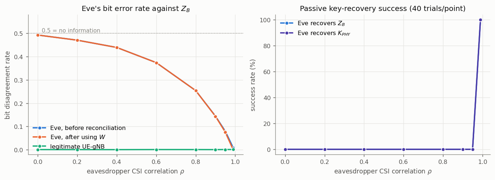
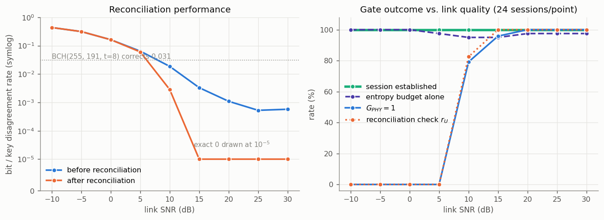
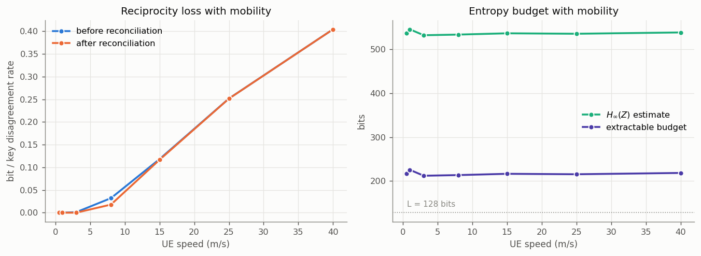
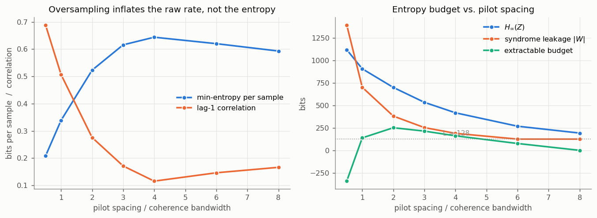
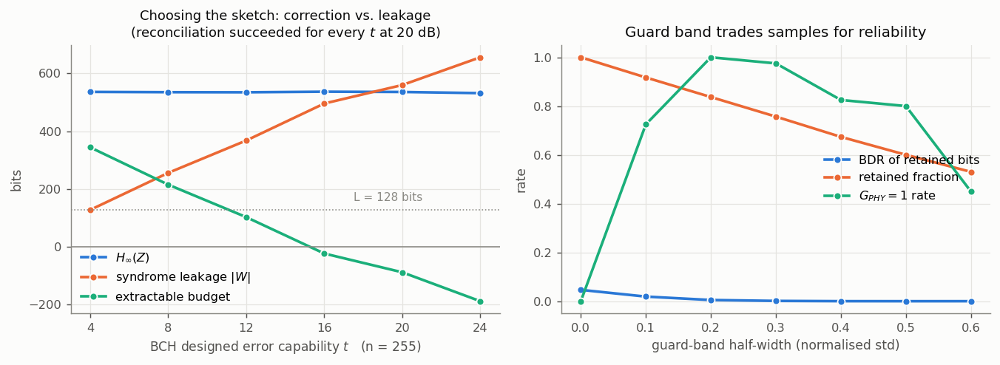
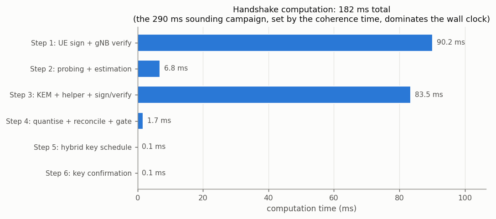
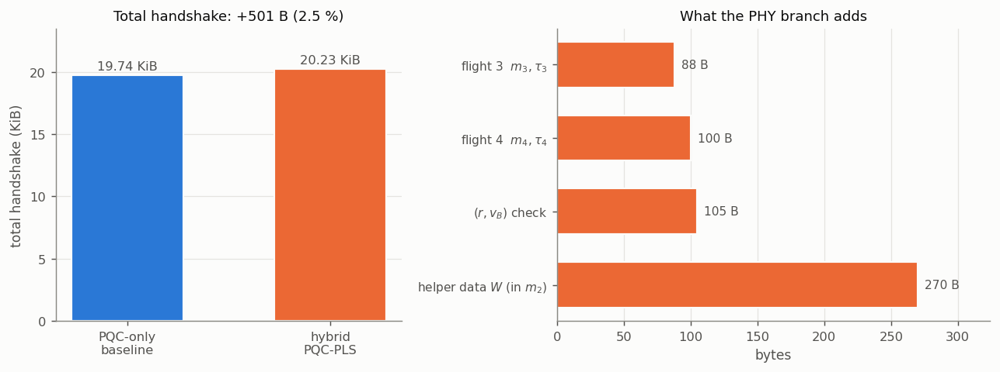
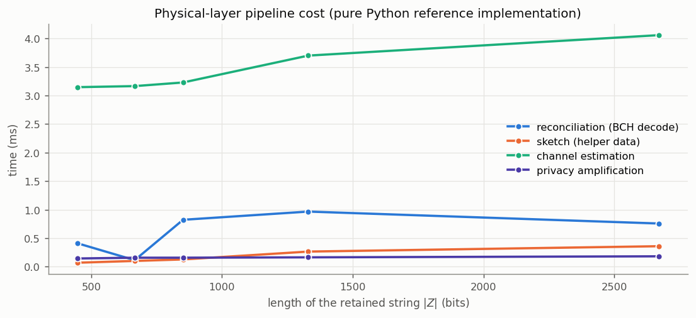

# Hybrid PQC-PLS key establishment - simulation report

Generated 2026-09-03 01:28 on Darwin arm64, Python 3.10.6.

Every cryptographic operation is a real implementation (ML-KEM-768 / FIPS 203, ML-DSA-65 / FIPS 204, AES-256-GCM, SHA3-256, HMAC-SHA-256, HKDF); the radio layer is a 3GPP TR 38.901 TDL Rayleigh channel with reciprocity impairments.

## 1. Configuration

| parameter | value |
|---|---|
| carrier / numerology | 3.5 GHz, 30 kHz SCS, 3276 subcarriers |
| channel | TDL-C, tau_rms = 300 ns, v = 3 m/s |
| f_D / T_c / B_c | 35.0 Hz / 12.1 ms / 667 kHz |
| probing | 24 rounds x 49 pilots (spacing 67 SC = 3 B_c), 8 symbols averaged |
| SNR (nominal / effective) | 20 dB / 29.0 dB |
| quantiser | 1 bit/sample, Gray, guard band 0.3 sigma |
| secure sketch | BCH(255, 191, t=8), 64 parity bits/block |
| PA / gate | L = 128 bits, eps = 2^-32, SNR_min = 10 dB |

## 2. Functional verification

| quantity | healthy link | degraded link |
|---|---|---|
| session state | ESTABLISHED | ESTABLISHED |
| G_PHY | True | False |
| \|K_PHY\| | 128 bits | 0 bits (epsilon) |
| session keys agree | True | True |
| BDR (retained bits) | 0.0023 | 0.4757 |
| KDR after reconciliation | 0.0000 | 0.4757 |
| reconciliation check r_U | pass | fail |

Entropy budget on the healthy link (leftover hash lemma):

    H_inf(Z) = 535.8 bits   (NIST SP 800-90B, min of MCV and Markov)
  - leak(W)  = 256 bits   (published BCH syndromes)
  - 2 log2(1/eps) = 64 bits
  = 215.8 bits extractable  >=  L = 128 bits  -> gate opens

## 3. Security evaluation

### 3.1 Attack suite: 19/19 attacks behave as required

| attack | outcome |
|---|---|
| A01-passive-eavesdrop | PASS - mean BDR_post=0.4649, recovery=0.0%, K_PHY match=0.0% |
| A02-rogue-ue-cert | PASS - step1: UE certificate invalid |
| A03-downgrade-alg-list | PASS - step1: sigma_U verification failed |
| A04-replay-flight1 | PASS - first session established=True; replay -> step1: ReplayCheck(sid, N_U) failed |
| A05-tamper-kem-ct | PASS - step3: sigma_B verification failed |
| A06-tamper-helper-data | PASS - step3: sigma_B verification failed |
| A07-stale-probe-context | PASS - step3: h_probe mismatch (probing context not bound) |
| A08-forge-tau3 | PASS - step4: tau_3 MAC verification failed |
| A09-bitflip-m3 | PASS - step4: tau_3 MAC verification failed |
| A10-tamper-m4 | PASS - step4: tau_4 MAC verification failed |
| A11-inconsistent-gate | PASS - step4: inconsistent joint gate decision |
| A12-tamper-finished | PASS - step6: UE key confirmation failed |
| A13-gphy-view-mismatch | PASS - step6: UE key confirmation failed |
| A14-data-plane-replay-tamper | PASS - fresh ok=True, replay=True, tamper=True, dir-swap=True |
| A15-pqc-compromise | PASS - G_PHY=True: keys recovered=False, PQC-only fallback recovers=False |
| A16-phy-compromise | PASS - keys recovered=False |
| A17-rogue-gnb-cert | PASS - step3: gNB certificate invalid |
| A18-mitm-vs-unauth-pls | PASS - unauthenticated baseline MITM succeeds 10/10; hybrid aborts (rogue UE cert=True, rogue gNB cert=True) |
| A19-phy-jamming-fallback | PASS - established=True, G_PHY=False, \|K_PHY\|=0 bits, d_U=False, d_B=False, r_U=False, BDR=0.454 |

### 3.2 Passive eavesdropping vs. CSI correlation

| rho | Eve BDR after using W | recovers Z | recovers K_PHY |
|---|---|---|---|
| 0.00 | 0.4921 | 0.0 % | 0.0 % |
| 0.20 | 0.4701 | 0.0 % | 0.0 % |
| 0.40 | 0.4388 | 0.0 % | 0.0 % |
| 0.60 | 0.3739 | 0.0 % | 0.0 % |
| 0.80 | 0.2540 | 0.0 % | 0.0 % |
| 0.90 | 0.1438 | 0.0 % | 0.0 % |
| 0.95 | 0.0757 | 0.0 % | 0.0 % |
| 0.99 | 0.0000 | 100.0 % | 100.0 % |

The physical-layer secret is useless to an eavesdropper up to rho ~ 0.95 and is fully compromised at rho = 0.99, i.e. when the attacker is effectively inside the coherence volume of the legitimate link.  In that worst case the session still rests on ML-KEM-768, which is exactly what the mandatory post-quantum baseline is for (attack A15/A16).

### 3.3 Gate behaviour vs. link SNR

| SNR (dB) | BDR | KDR | r_U | entropy check | G_PHY | established |
|---|---|---|---|---|---|---|
| -10 | 0.4357 | 0.4357 | 0.0 % | 100.0 % | 0.0 % | 100.0 % |
| -5 | 0.3137 | 0.3137 | 0.0 % | 100.0 % | 0.0 % | 100.0 % |
| 0 | 0.1622 | 0.1618 | 0.0 % | 100.0 % | 0.0 % | 100.0 % |
| 5 | 0.0641 | 0.0602 | 0.0 % | 97.5 % | 0.0 % | 100.0 % |
| 10 | 0.0186 | 0.0028 | 82.5 % | 95.0 % | 79.2 % | 100.0 % |
| 15 | 0.0033 | 0.0000 | 100.0 % | 95.0 % | 95.8 % | 100.0 % |
| 20 | 0.0011 | 0.0000 | 100.0 % | 97.5 % | 100.0 % | 100.0 % |
| 25 | 0.0005 | 0.0000 | 100.0 % | 97.5 % | 100.0 % | 100.0 % |
| 30 | 0.0006 | 0.0000 | 100.0 % | 97.5 % | 100.0 % | 100.0 % |

Two observations matter here.  First, the handshake completes at **every** SNR: a dead radio link degrades the session to the post-quantum baseline instead of failing it.  Second, the entropy estimator alone accepts even a -10 dB link, because receiver noise *adds* apparent entropy while destroying reciprocity.  What actually closes the gate at low SNR is the local SNR test together with the interactive reconciliation check `r_U`; an entropy budget on its own would not be a safety mechanism.

### 3.4 Entropy vs. pilot spacing

| spacing / B_c | samples | lag-1 rho | H_inf/sample | H_inf | leak | budget | G_PHY |
|---|---|---|---|---|---|---|---|
| 0.5 | 7128 | 0.689 | 0.208 | 1122 | 1397 | -339 | 0.0 % |
| 1.0 | 3552 | 0.507 | 0.339 | 910 | 704 | 142 | 60.0 % |
| 2.0 | 1776 | 0.276 | 0.523 | 702 | 384 | 254 | 100.0 % |
| 3.0 | 1152 | 0.171 | 0.616 | 537 | 256 | 217 | 97.5 % |
| 4.0 | 864 | 0.116 | 0.644 | 420 | 192 | 164 | 95.0 % |
| 6.0 | 576 | 0.146 | 0.620 | 271 | 128 | 79 | 0.0 % |
| 8.0 | 432 | 0.166 | 0.593 | 195 | 128 | 3 | 0.0 % |

Sampling the channel more finely than the coherence bandwidth multiplies the raw bit count but not the entropy, while the syndrome leakage grows linearly with the raw length - so the extractable budget *falls*, and at half a coherence bandwidth it goes negative. This is the quantitative form of the requirement that the entropy budget be evaluated on the real source, not on the raw sample count.

### 3.5 Mobility (probe interval held at 12 ms)

| speed (m/s) | BDR | KDR | H_inf | budget | G_PHY |
|---|---|---|---|---|---|
| 0.5 | 0.0000 | 0.0000 | 537 | 217 | 92.5 % |
| 1.0 | 0.0000 | 0.0000 | 546 | 226 | 100.0 % |
| 3.0 | 0.0012 | 0.0000 | 532 | 212 | 97.5 % |
| 8.0 | 0.0321 | 0.0179 | 534 | 214 | 17.5 % |
| 15.0 | 0.1181 | 0.1167 | 537 | 217 | 0.0 % |
| 25.0 | 0.2518 | 0.2516 | 536 | 216 | 0.0 % |
| 40.0 | 0.4044 | 0.4044 | 539 | 219 | 0.0 % |

With the sounding cadence fixed, reciprocity collapses above roughly 8 m/s while the estimated entropy and the extractable budget stay essentially flat - the same lesson as section 3.3, from the opposite direction: the entropy budget bounds how much can be *extracted*, and only the reconciliation check decides whether the two sides hold the *same* string.  The default configuration keeps the probe interval at one coherence time, so it tracks mobility automatically; the table shows what happens if it does not.

## 4. Performance

| step | mean (ms) | p95 (ms) |
|---|---|---|
| Step 1  UE sign + gNB verify | 90.22 | 159.81 |
| Step 2  probing + estimation | 6.85 | 7.21 |
| Step 3  KEM + helper + sign/verify | 83.48 | 125.75 |
| Step 4  quantise + reconcile + gate | 1.70 | 2.17 |
| Step 5  hybrid key schedule | 0.11 | 0.11 |
| Step 6  key confirmation | 0.05 | 0.06 |
| **total computation** | **182.42** | **286.46** |
| sounding campaign (wall time) | 290 | 290 |

The physical-layer branch of the handshake (Step 2 estimation plus Step 4 quantisation, reconciliation, gating and amplification) costs 8.6 ms, against 173.7 ms for the post-quantum operations.  The dominant term is neither: it is the 290 ms sounding campaign, which is fixed by the coherence time (12.1 ms) and the number of independent rounds needed to reach 128 extractable bits.

| message | PQC-only (B) | hybrid (B) | delta |
|---|---|---|---|
| flight1 | 10047 | 10047 | +0 |
| flight2 | 10055 | 10263 | +208 |
| fin_u | 55 | 55 | +0 |
| fin_b | 55 | 55 | +0 |
| helper data W (inside flight2) | 0 | 270 | +270 |
| mconf | 0 | 105 | +105 |
| flight3 | 0 | 88 | +88 |
| flight4 | 0 | 100 | +100 |
| **total** | **20212** | **20713** | **+501** |

The authenticated physical-layer augmentation costs 501 bytes, i.e. 2.5 % on top of the PQC-only handshake, whose size is itself dominated by the two ML-DSA-65 certificates.

| primitive | mean (ms) |
|---|---|
| ML-KEM-768 KeyGen | 2.847 |
| ML-KEM-768 Encaps | 3.881 |
| ML-KEM-768 Decaps | 5.167 |
| ML-DSA-65 KeyGen | 9.150 |
| ML-DSA-65 Sign | 53.954 |
| ML-DSA-65 Verify | 10.669 |
| SHA3-256 (1 KiB) | 0.003 |
| HKDF-Extract+Expand | 0.011 |
| HMAC-SHA-256 tag | 0.003 |
| AES-256-GCM seal 1 KiB | 0.006 |
| BCH(255,191) sketch | 0.032 |
| BCH(255,191) decode t=8 | 0.660 |

These are pure-Python reference implementations (`kyber-py`, `dilithium-py`); an optimised C/AVX2 implementation of ML-KEM/ML-DSA is roughly two orders of magnitude faster, and the BCH decoder here is also unoptimised Python.  The numbers should therefore be read as *relative* costs: the lattice operations dominate the computation and the physical-layer pipeline is a small addition to them.

| payload (B) | records/s | throughput (MB/s) | AEAD expansion |
|---|---|---|---|
| 64 | 80747 | 5.2 | +16 B (25.0 %) |
| 256 | 80560 | 20.6 | +16 B (6.2 %) |
| 1024 | 79043 | 80.9 | +16 B (1.6 %) |
| 1400 | 77367 | 108.3 | +16 B (1.1 %) |
| 8192 | 66663 | 546.1 | +16 B (0.2 %) |

## 5. Figures

*passive eavesdropper: bit error rate and key-recovery success vs. CSI correlation*

*reconciliation performance and gate outcome vs. link SNR*

*reciprocity loss and entropy budget vs. speed*

*raw sampling rate vs. real min-entropy and extractable budget*

*BCH strength and guard-band width trade-offs*

*handshake computation latency per step*

*on-the-wire cost per message*

*physical-layer pipeline cost vs. campaign size*

## 6. Findings

1. **Correctness.** Both regimes complete: with a healthy link the session key mixes K_PQC and a 128-bit K_PHY; with a dead link the gate closes and the same session key schedule runs on the post-quantum secret alone.  The two parties never disagree, because `G_PHY` is authenticated in Step 4 and re-checked inside the key-confirmation associated data in Step 6.
2. **Authentication is what makes PLS safe here.** 19/19 attacks are caught at the step the protocol design predicts: certificate and signature checks in Steps 1 and 3, `h_probe` binding against replayed probing campaigns, the `k_gate` MAC against forged gate decisions, and the AEAD key confirmation against transcript or `G_PHY` mismatch.  An unauthenticated PLS scheme with the same radio layer is fully MITM-able (A18).
3. **The hybrid guarantee holds in both directions.** Giving the adversary K_PQC leaves her the full min-entropy of K_PHY, and giving her K_PHY leaves her ML-KEM-768 (A15, A16).  The length-prefixed composition `l_PQC || K_PQC || l_PHY || K_PHY` under a transcript-keyed extract makes the epsilon case unambiguous.
4. **Denial of the PLS component is not denial of service** (A19): jamming the sounding campaign yields `G_PHY = 0`, not a failed handshake.
5. **Cost.** +501 B (2.5 %) on the wire and a few milliseconds of computation; the real price of the physical layer is latency - 290 ms of channel sounding, set by the coherence time, not by the cryptography.

## 7. Limitations

* The channel is a stochastic TDL model, not a measured trace; the absolute key rates depend on the delay-spread and mobility assumptions.
* Min-entropy is *estimated* (NIST SP 800-90B MCV and first-order Markov) on a single session's samples; a deployment would use a long-run entropy assessment and a conservative fixed per-sample figure, and the estimator does not detect low-SNR conditions (section 3.3).
* The retained-sample mask inside W is public and conditions the distribution of the retained samples; the budget is therefore computed on the retained sequence, but the mask's own leakage about |Y| is not otherwise charged.
* `v_B = H_conf(r || Z_B)` is treated as a computational commitment; an information-theoretic accounting would charge its output length against the budget.
* Reciprocity impairments are modelled as static gain errors plus the TDD sounding gap; hardware effects such as non-linear PA distortion and IQ imbalance are not modelled.
